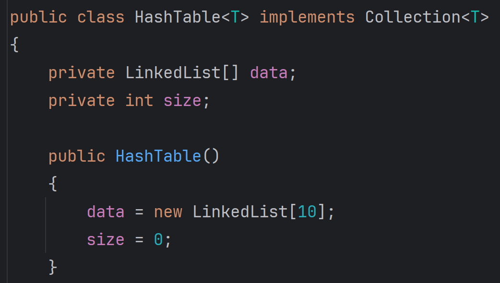

# Individual Assignment: Hash Tables 

## Hash Tables Part #1  

For this assignment, you will be building a basic hashtable that uses separate chaining to handle 
collisions. In separate chaining, each index of the hashtable contains a linked list. When 
collisions occur, the colliding elements are appended to the linked list at the relevant index. 
This approach provides an efficient mechanism to manage collisions. However, it's important 
to choose an appropriate load factor for the hashtable. If the load factor is not properly 
managed, the linked lists may become too long, which can significantly reduce the efficiency 
of the hashtable.

## Objectives  
### Course  

- Develop a set or map data structure based on hash tables or binary search trees and implement basic set operations.  

### Module  

- To use hash codes to quickly identify positions in a data structure for new or existing elements.  
- To resolve collisions in a data structure using either separate chaining or open addressing.  
- To write an iterator over a complex structure.  

## Separate Chaining  

As described above, a separate chaining table maintains a linked list at each position in the hash table. When an 
element is added to the table the hash code is first used to find a position in the table. This position 
never changes unlike open addressing algorithms. Instead each element that is placed to that position is added 
to a linked list at the position. 

As elements collide in the table, they are placed in a shared linked list, 
whose size should be minimized for the table to maintain a constant runtime. 
After adding the following elements with hash codes:  

After adding the following elements with hash codes: C (23), B (111), A (17), D (3)


After adding more elements: F (99), E (1), H (55), G (21), A (17)


When removing elements from the table, a position is identified first through a hash code and then a search is 
made through the linked list at that position (if there are any elements). A similar routine is used to 
search for elements in the table with the contains() method. 

For example, trying to remove element G (21) would result in the following operation: 


Writing an iterator for this structure can be particularly challenging. The iterator should return 
the elements of the table from top-to-bottom. For example, given the table above iterator 
should return elements in the following order: 

```text
B, E, G, C, D, H, A, F
```

The iterator will need to traverse linked lists when present and avoid missing lists (null pointers).
Once a list has been exhausted of elements, the iterator should then move to the next position in the 
table that contains a non-null linked list.

**Note:** When implementing the iterator, you should not copy the data from the table into a separate
data structure. Instead, you should write the iterator to traverse the table and linked lists directly.

## Writing the Hash Table  

Your job is to write the hash table described above. Your HashTable class must use the ICollection.java 
interface:


## Unit Tests  
You have also been provided with a group of unit tests that you can use to verify that your 
hash table is working correctly. The tests assume your class is called HashTable. Your instructor
will grade the correctness of your implementation by running these tests.


## Expectation: Working Directly With Linked List Nodes  
Part of the learning experience on this assignment is to use the Node objects for a linked
list directly. This is more efficient than using the methods in a LinkedList class, since
the methods in a LinkedList class are designed to be general and work with any type of data.

When writing the HashTable class you should avoid the LinkedList class altogether. Instead,
you should write your own Node class and use it to build the linked lists in your hash table.
Here is an example of how to do this correctly:  

**The "wrong" way**



**The "right" way**


## Requirements  
1. Verify that your tests are passing successfully.
2. Verify that your assignment is passing a linter check using the IntelliJ inspector tool.
3. Lastly, ensure your code is correctly pushed to your GitHub classroom repository.
    